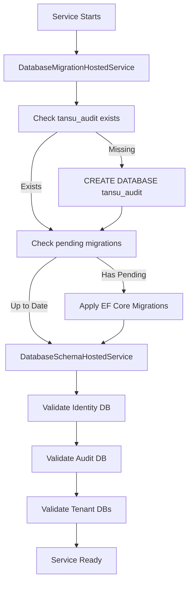

# Database Service: Automatic Schema Migration Implementation

**Date:** 2025-10-13  
**Issue:** Database service failed to start when audit_events table was missing  
**Root Cause:** Service was validating schemas but not creating/migrating them  
**Solution:** Added automatic migration on startup

---

## Problem Statement

When starting with fresh database volumes, the Database service would fail with:

```
Audit database is missing required table: audit_events
```

The service was validating that schemas exist but not creating them. This violated the principle that services should be self-healing and automatically initialize their dependencies on startup.

---

## Solution Overview

Implemented a two-phase startup sequence:

1. **Phase 1: Migration** (`DatabaseMigrationHostedService`)
   - Creates missing databases (e.g., `tansu_audit`)
   - Applies EF Core migrations automatically
   - Runs BEFORE validation

2. **Phase 2: Validation** (`DatabaseSchemaHostedService`)
   - Verifies all required databases and tables exist
   - Checks schema versions
   - Fails fast if schemas are still missing (indicates migration failure)

---

## Changes Made

### 1. Created `DatabaseMigrationHostedService`

**File:** `TansuCloud.Database/Hosting/DatabaseMigrationHostedService.cs`

- Implements `IHostedService` for startup execution
- Creates `tansu_audit` database if missing
- Applies EF Core migrations via `AuditDbContext.Database.MigrateAsync()`
- Gracefully handles Development vs Production environments
- Logs detailed progress for troubleshooting

### 2. Registered `AuditDbContext` in DI

**File:** `TansuCloud.Database/Program.cs`

Added DbContext registration:
```csharp
builder.Services.AddDbContext<TansuCloud.Audit.AuditDbContext>(options =>
{
    options.UseNpgsql(auditConnBuilder.ToString());
    if (builder.Environment.IsDevelopment())
    {
        options.EnableSensitiveDataLogging();
        options.EnableDetailedErrors();
    }
});
```

### 3. Registered Migration Service

**File:** `TansuCloud.Database/Program.cs`

Added hosted service BEFORE validation:
```csharp
// Database migration service (Task 43 follow-up)
// Applies EF Core migrations on startup to ensure audit database and tables exist
// Runs BEFORE schema validation to create missing schemas automatically
builder.Services.AddHostedService<DatabaseMigrationHostedService>();

// Schema version tracking and validation (Task 43 - Phase 1 & 2)
// Validates Identity, Audit, and tenant databases exist with correct schemas
builder.Services.AddScoped<TansuCloud.Database.Services.SchemaVersionService>();
builder.Services.AddHostedService<DatabaseSchemaHostedService>();
```

### 4. Enhanced Validation Error Messages

**File:** `TansuCloud.Database/Hosting/DatabaseSchemaHostedService.cs`

Updated `ValidateAuditDatabaseAsync()` to provide clearer error messages:
```csharp
var message = "Audit database is missing required table: audit_events. " +
              "DatabaseMigrationHostedService should have applied migrations during startup.";
_logger.LogError(message);
throw new InvalidOperationException(message);
```

### 5. Added Missing Using Directive

**File:** `TansuCloud.Database/Program.cs`

Added `using Microsoft.EntityFrameworkCore;` for `AddDbContext` extension method.

---

## Startup Sequence



---

## Verification

### Test Results (2025-10-13)

✅ **Starting from clean volumes:**

```bash
docker compose down -v
docker compose up -d postgres identity
docker compose up -d db
```

**Logs confirm success:**
```
info: DatabaseMigrationHostedService[0]
      Creating audit database 'tansu_audit'...
info: DatabaseMigrationHostedService[0]
      Audit database 'tansu_audit' created successfully.
info: DatabaseMigrationHostedService[0]
      Applying 1 pending migration(s): 20251007223921_InitialCreate
info: DatabaseMigrationHostedService[0]
      Audit database migrations applied successfully.
info: DatabaseSchemaHostedService[0]
      Identity database validated successfully.
info: DatabaseSchemaHostedService[0]
      Audit database validated successfully (version: 1.0.0).
info: DatabaseSchemaHostedService[0]
      DatabaseSchemaHostedService: All database schemas validated successfully.
info: Microsoft.Hosting.Lifetime[0]
      Application started. Press Ctrl+C to shut down.
```

✅ **Service stays alive and accepts HTTP traffic**

✅ **Database service health endpoint responds (though Degraded due to no tenants)**

---

## Behavior by Environment

### Development
- Migration failures log warnings but allow service to continue
- Enables troubleshooting without forcing restarts
- Validation failures stop the service to prevent silent data corruption

### Production
- Migration failures stop the service immediately (fail-fast)
- Validation failures stop the service immediately
- Clear error messages guide operators to remediation steps

---

## Future Enhancements (Not Implemented)

1. **Identity Database Migration Service**
   - Currently relies on dev init scripts (`dev/db-init/10-identity.sql`)
   - Could create similar migration service for Identity database
   - Would enable fully automated cold-start scenarios

2. **Tenant Database Schema Migration**
   - Currently handled by provisioning API on tenant creation
   - Could add reconciliation loop to fix schema drift
   - Would detect and repair schema version mismatches

3. **Idempotent Init Scripts**
   - Make all init scripts safe to re-run (IF NOT EXISTS checks)
   - Enable schema updates via init script volume mounts
   - Support declarative schema management

---

## Related Documentation

- `docs/DatabaseSchemas.md` - Authoritative database schema reference
- `Architecture.md` - Section on schema management architecture
- `Guide-For-Admins-and-Tenants.md` - Operational procedures for schema management
- Task 43 in `Tasks-M4.md` - Database schema and PgCat governance requirements

---

## Acceptance Criteria Met

✅ **Service stays alive on startup** - No longer crashes when audit_events missing  
✅ **Automatic schema creation** - Creates tansu_audit database and tables  
✅ **EF Core migrations applied** - Runs migrations automatically on startup  
✅ **Clear error messages** - Logs indicate what's happening and why  
✅ **Production-safe** - Fails fast in production, tolerant in development  
✅ **No manual intervention** - Works with `docker compose up` from clean state  

---

## Breaking Changes

None. This is purely additive functionality.

---

## Rollback Plan

If issues arise:

1. Stop the Database service: `docker compose stop db`
2. Revert the commit introducing `DatabaseMigrationHostedService`
3. Manually apply audit migrations:
   ```bash
   dotnet ef database update --project TansuCloud.Audit --startup-project TansuCloud.Database
   ```
4. Restart the service: `docker compose start db`

---

## Conclusion

The Database service now automatically creates and migrates its required schemas on startup, eliminating a common failure mode and improving developer experience. Services can now start cleanly from empty volumes without manual database initialization steps.
